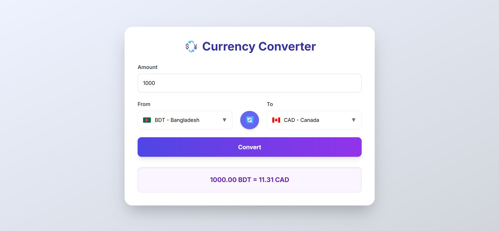

# 💱 Currency Converter

A modern, responsive **Currency Converter** web app built with **HTML, Tailwind CSS, and JavaScript**.  
Convert amounts between multiple currencies with **real-time exchange rates**, search functionality, and country flags.

---

### 🖼 Screenshot



---

## 🌐 Live Demo

[View Live Demo](https://shawnazd.github.io/currency-converter/)

---

## 🔹 Features

- ✅ Real-time currency conversion using **Open Exchange Rates API**
- ✅ Searchable currency dropdowns (type “United” → shows United States, United Kingdom, etc.)
- ✅ Displays **country name and flag** beside currency
- ✅ Swap currencies with a single click
- ✅ Automatic conversion as you type (no need to click “Convert”)
- ✅ Responsive and modern UI with **Tailwind CSS**

---

## 💻 How to Use

1. Enter the **amount** you want to convert.  
2. Select the **From** currency (search by code or country).  
3. Select the **To** currency (search by code or country).  
4. Conversion happens automatically as you type.  
5. Use the **🔄 Swap button** to switch currencies quickly.

---

## 🛠 Technologies Used

- **HTML5**
- **Tailwind CSS**
- **JavaScript (ES6)**
- **Open Exchange Rates API**

---

## 📂 Getting Started (Locally)

1. Clone the repository:

```bash
git clone https://github.com/shawnazd/currency-converter.git
````

2. Navigate to the project folder:

```bash
cd currency-converter
```

3. Open `index.html` in your browser.
   No server required — works locally.

---

## ⚡ Deployment (GitHub Pages)

1. Push your code to a GitHub repository.
2. Go to **Settings → Pages → Branch → main → Root**.
3. Save and wait 30–60 seconds.
4. Your live site will be available at:

```
https://your-username.github.io/repo-name/
```

---

## 👤 Developer

* **Shawn**
* GitHub: [shawnazd](https://github.com/shawnazd)

